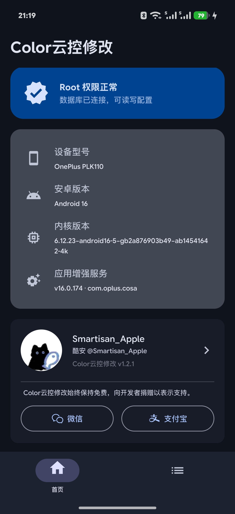
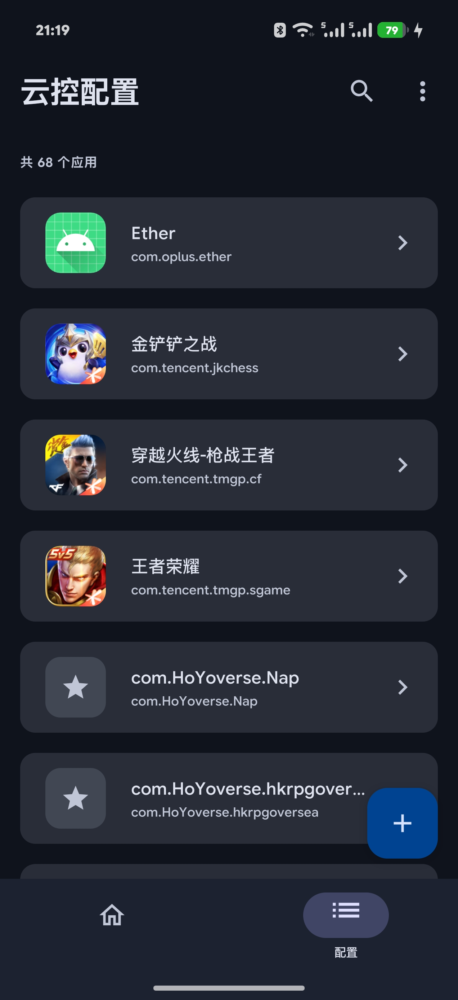
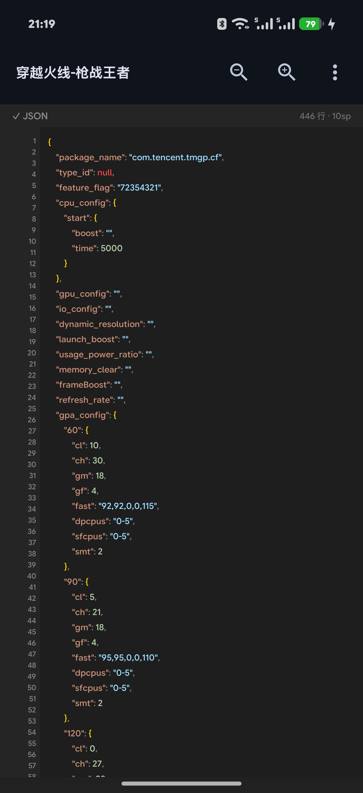

# Oplus Remote Config Override (欧真加云控数据覆盖)

通过修改 `com.oplus.cosa`（应用增强服务）数据库，覆盖游戏云控配置，优化风驰策略。

> ⚠ **需要 Root 权限**  
> 本工具需要 Root 权限才能读写系统应用数据库，未 Root 的设备无法使用。

---

## 功能

- 📋 **配置管理** — 查看所有已配置的应用列表，支持按包名搜索过滤
- 📝 **JSON 编辑器** — 集成语法高亮、实时语法校验与缩放功能，提供流畅的编辑体验
- 📥 **配置导入/导出** — 支持导入自定义应用配置，同时可将指定配置导出到本地存储
- 🔄 **自动备份与回退** — 修改配置时自动创建备份，支持一键恢复到上一版本
- 💾 **数据库写入** — 将编辑后的配置一键写入 `com.oplus.cosa` 的 `db_game_database`
- 🗑️ **配置删除** — 长按配置列表项可从数据库及本地存储中删除对应配置
- ⚙️ **系统维护** — 支持重启应用增强服务及清除应用增强服务数据
- ℹ️ **设备信息** — 查看设备型号、Android 版本、内核版本、应用增强服务版本

## 云控配置参考文档

> 📖 **[欧加云控配置解析](欧加云控配置解析.md)** — 以 **一加 15（SM8850）** 为例，详细解析云控各字段的含义、取值范围与用法，包含 CPU 频率表、GPA 调度、温控锁帧、FPS 稳定器等完整说明。修改配置前建议先阅读此文档。

## 截图

| 首页 | 配置列表 | JSON 编辑器 |
|------|----------|-------------|
|  |  |  |

## 构建

### 环境要求

- Android Studio Hedgehog 2023.1+ (JDK 17)
- Android SDK 34

### 编译

```bash
cd android

# Debug APK
./gradlew assembleDebug

# Release APK
./gradlew assembleRelease
```

APK 输出位置：

```
android/app/build/outputs/apk/debug/app-debug.apk
android/app/build/outputs/apk/release/app-release.apk
```

### 直接安装

编译后直接安装 APK 并授予 Root 权限即可使用。不需要刷入 Magisk 模块。

## 技术栈

- **UI**: Jetpack Compose + Material 3
- **导航**: Jetpack Navigation Compose
- **Root 交互**: libsu (topjohnwu)
- **数据库**: `com.oplus.cosa` SQLite (通过 Root Shell 操作)
- **序列化**: kotlinx-serialization-json
- **语法高亮**: 自定义轻量状态机解析器（无第三方依赖）

## 项目结构

```
android/app/src/main/kotlin/com/remoteconfig/override/
├── App.kt                    # Application 入口
├── MainActivity.kt           # 主 Activity
├── data/
│   └── DatabaseManager.kt    # Root Shell + SQLite 数据库操作
├── model/
│   └── GameConfig.kt         # 数据模型
├── navigation/
│   └── NavGraph.kt           # 导航图 + 底部导航栏
├── ui/
│   ├── screens/
│   │   ├── HomeScreen.kt         # 首页
│   │   ├── GameListScreen.kt     # 配置列表
│   │   └── ConfigEditorScreen.kt # JSON 编辑器
│   └── theme/
│       ├── Color.kt
│       ├── Theme.kt
│       └── Type.kt
└── viewmodel/
    └── MainViewModel.kt      # 主 ViewModel
```

## 开源协议

本项目基于 **GPL-3.0** 协议开源。

## 捐赠支持

Color云控修改始终保持免费使用。如果你觉得这个工具对你有帮助，可以考虑请作者喝杯咖啡 ☕

| 微信支付 | 支付宝 |
|----------|--------|
|  |  |

感谢每一位捐赠者的支持 ❤️

## 免责声明

- 修改系统配置有风险，请谨慎操作
- 作者不对因使用本工具导致的任何问题负责
- 请勿用于商业用途

## 致谢

- [KernelSU-Next](https://github.com/rifsxd/KernelSU-Next) - UI 设计参考
- [ReSukiSU](https://github.com/Googlers-Repo/ReSukiSU) - UI/UX 设计参考
- [libsu](https://github.com/topjohnwu/libsu) - Root Shell 交互库
