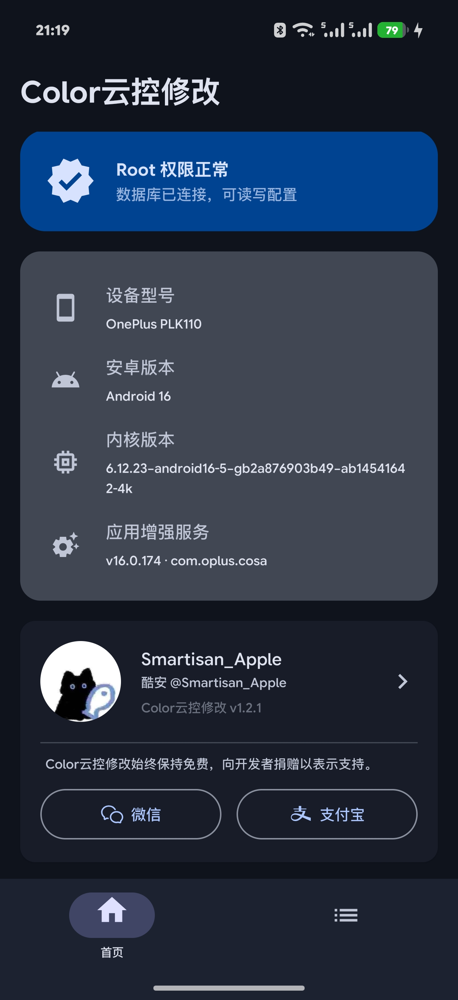
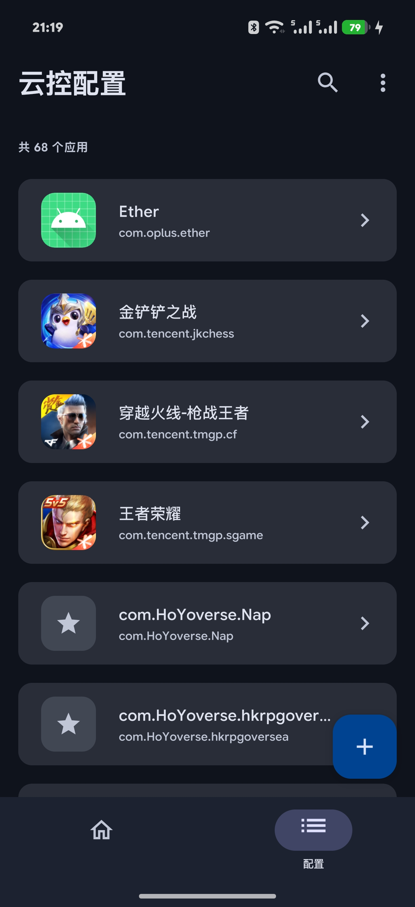
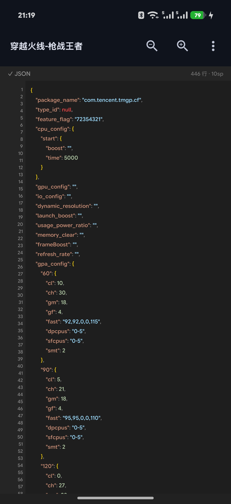

# Oplus Remote Config Override (欧真加云控数据覆盖)

通过修改 `com.oplus.cosa`（应用增强服务）数据库，覆盖游戏云控配置，优化风驰策略。同时支持小米 HyperOS 的 `com.xiaomi.joyose` 云控。

> ⚠ **需要 Root 权限**  
> 本工具需要 Root 权限才能读写系统应用数据库，未 Root 的设备无法使用。

---

## 功能

- 📋 **配置管理** — 查看所有已配置的应用列表，支持按包名搜索过滤
- 📝 **JSON 编辑器** — 集成语法高亮、实时语法校验与缩放功能，提供流畅的编辑体验
- 📥 **配置导入/导出** — 支持导入自定义应用配置，同时可将指定配置导出到本地存储
- 🔐 **本地配置保护** — 写入配置后自动启用本地配置保护触发器，避免云端覆盖
- 💾 **数据库写入** — 将编辑后的配置一键写入 `com.oplus.cosa` 的 `db_game_database`
- 🗑️ **配置删除** — 长按配置列表项可从数据库删除对应配置
- ⚙️ **系统维护** — 支持清除应用增强服务数据
- ℹ️ **设备信息** — 查看设备型号、Android 版本、内核版本、应用增强服务版本

## 截图

| 首页 | 配置列表 | JSON 编辑器 |
|------|----------|-------------|
|  |  |  |

## 构建

### 环境要求

- JDK 21（Gradle 运行与 Kotlin/JVM 目标均为 21）
- Android SDK 37（compileSdk；Compose BOM 2026.08.00 / material-kolor 5.0.0 要求 minCompileSdk 37）
- Rust stable、Android NDK（需包含 `aarch64-linux-android` 工具链）
- SQLite 采用 `bundled` 特性随二进制内嵌编译，**不再依赖目标设备的系统 `libsqlite.so`**。
  （历史背景：旧版动态链接系统 SQLite，Android 13 设备系统库为 3.32，缺少 `modern_sqlite`
  绑定需要的 `sqlite3_changes64`/`sqlite3_error_offset` 符号（≥3.38），导致 CLI 无法加载、全部功能失效。）
- 重建 `libcosa.so` 后可用 `rust/build-android.sh` 自检产物是否包含预期功能字符串，避免再次发布陈旧二进制。

### 编译

```bash
# 编译 Rust 数据库工具并放入 APK 的 native 库目录（含产物自检）
cd rust
NDK=/path/to/android-ndk ./build-android.sh
# 等价手工步骤：
# export PATH="$NDK/toolchains/llvm/prebuilt/linux-x86_64/bin:$PATH"
# CC_aarch64_linux_android=aarch64-linux-android24-clang \
#   cargo build --release --target aarch64-linux-android
# cp target/aarch64-linux-android/release/cosa ../android/app/src/main/jniLibs/arm64-v8a/libcosa.so

cd android

# Debug APK
./gradlew assembleDebug

# Release APK
./gradlew assembleRelease
```

APK 输出位置：

```
android/app/build/outputs/apk/debug/app-debug.apk
android/app/build/outputs/apk/release/app-release-unsigned.apk
```

在 arm64 proot 主机上若 AGP 自带的 aapt2 无法启动，可将系统 arm64
aapt2 通过参数覆盖：

```bash
./gradlew -Pandroid.aapt2FromMavenOverride=/usr/lib/android-sdk/build-tools/34.0.0/aapt2 assembleDebug
```

### 直接安装

编译后直接安装 APK 并授予 Root 权限即可使用。不需要刷入 Magisk 模块。

## 技术栈

- **UI**: Jetpack Compose + Material 3，**双 UI 模式**（Miuix 0.9.3 / Material 3，设置内即时切换，两套主题与页面外壳）
- **导航**: Navigation3（`androidx.navigation3`，类型安全路由；宽屏与窄屏共用同一导航图）
- **液态玻璃底栏**: miuix-blur（API 33+，可在设置内关闭回退纯色底栏）
- **主题取色**: material-kolor 5.0.0（keyColor / palette style / color spec，对齐 KernelSU ColorPalette）
- **平板适配**: material3-window-size-class（Google 标准 WindowSizeClass；宽屏 NavigationRail + 配置页 list-detail 双窗格，纯应用内布局，无需 OPPO 平行视窗）
- **Root 交互**: libsu (topjohnwu)
- **数据库**: `com.oplus.cosa` SQLite (Rust `rusqlite` 原生工具，通过 Root Shell 操作)

Rust 工具内嵌编译的 SQLite（`bundled` 特性），不依赖设备系统库；当前构建目标为
64 位 Android（`arm64-v8a`）。
- **序列化**: kotlinx-serialization-json
- **语法高亮**: 自定义轻量状态机解析器（无第三方依赖）

## 项目结构

```
android/app/src/main/kotlin/com/remoteconfig/override/
├── App.kt                    # Application 入口
├── MainActivity.kt           # 主 Activity（Navigation3 NavDisplay + 双主题分发）
├── data/
│   └── DatabaseManager.kt    # Root Shell + Rust 数据库工具调用
├── model/
│   └── GameConfig.kt         # 数据模型
├── navigation/
│   ├── Navigator.kt          # Navigation3 导航器
│   └── Routes.kt             # 类型安全路由定义
├── settings/
│   ├── AppSettingsRepository.kt # 设置仓库（SharedPreferences + 可观察状态）
│   ├── ColorMode.kt          # 深浅色模式（跟随系统/浅/深）
│   └── UiMode.kt             # 双 UI 模式（Miuix / Material）
├── ui/
│   ├── component/
│   │   ├── glass/            # 液态玻璃底栏（AndroidLiquidGlass backdrop 封装）
│   │   └── rememberContentReady.kt # 重内容延迟组装
│   ├── screens/              # 首页/配置列表/编辑器/取色/设置，每屏 Miuix+Material 双实现 + 分发器
│   └── theme/                # 双主题（MiuixTheme/MaterialTheme）+ 取色参数消费
└── viewmodel/
    └── MainViewModel.kt      # 主 ViewModel（数据层不动）
rust/
├── src/main.rs               # ColorOS cosa CLI + joyose 分发
├── src/joyose/               # HyperOS Joyose：store/migt/scoped/appview/caps/resolve
├── rust-toolchain.toml
└── Cargo.toml
```

## 开源协议

本项目基于 **GPL-3.0** 协议开源。

## 捐赠支持

Color云控修改始终保持免费使用。如果你觉得这个工具对你有帮助，可以考虑请作者喝杯咖啡 ☕

| 微信支付 | 支付宝 |
|----------|--------|
|  |  |

感谢每一位捐赠者的支持 ❤️

## 免责声明

- 修改系统配置有风险，请谨慎操作
- 作者不对因使用本工具导致的任何问题负责
- 请勿用于商业用途

## 致谢

- [KernelSU-Next](https://github.com/rifsxd/KernelSU-Next) - UI 设计参考
- [ReSukiSU](https://github.com/Googlers-Repo/ReSukiSU) - UI/UX 设计参考
- [libsu](https://github.com/topjohnwu/libsu) - Root Shell 交互库
